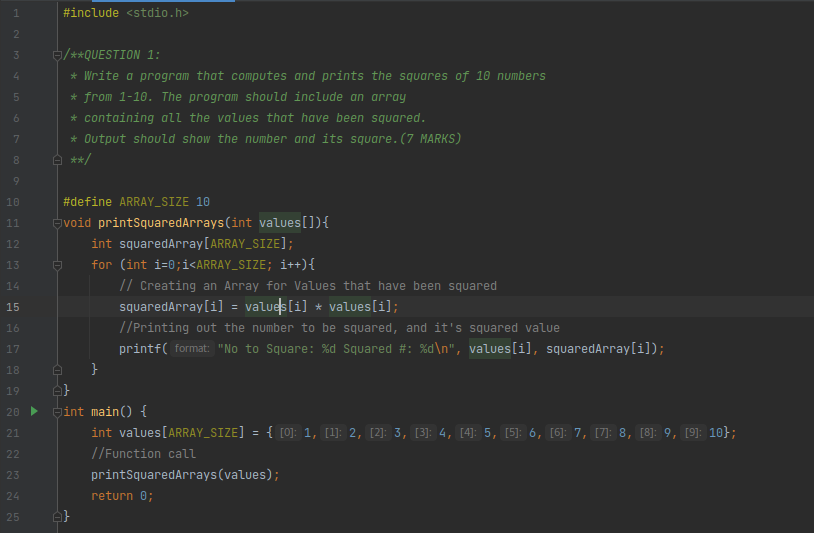
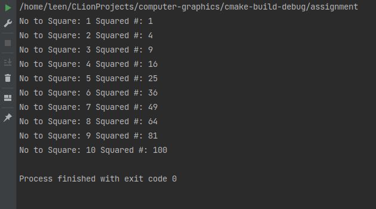

# QUESTION 1:
* Write a program that computes and prints the squares of 10 numbers from 1-10. The program should include an array containing all the values that have been squared. output should show the number and its square. (7 MARKS)

### Code

### Output
